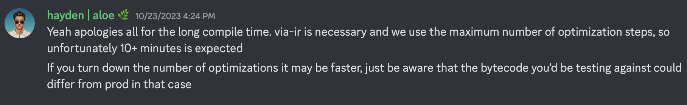

# Compilation and Testing
### Compilation
Contract compilation can be expected to take 10+ minutes. According to the team, this is expected. via-ir was enabled and in fact necessary, as a stack error is thrown otherwise. The maximum number of optimization steps were used. The team noted that if the number of optimizations are turned down it may be faster, though the bytecode being tested against could differ from prod. 

Recommended course of action: give the contracts time to compile, rather than making any changes. Analyst found that it took roughly 22 minutes to compile all of the contracts.

### Testing
After contract compilation, it took about 10 minutes to run the 172 tests in the testing suite. Some tests take substantially longer than others to run, so the use of --match-test or --match-contract flags is advised. Initial testing resulted in 11 failing tests. Nine of the tests were failing due to uninitialized environment variables. Create a .env file in aloe-ii/core, with the following variables defined: RPC_URL_OPTIMISM and RPC_URL_MAINNET. The other 2 failing tests were resulting from foundry's ffi cheatcode, which requires the --ffi flag, so it's recommended to include this when running the tests.

### Coverage
When generating test coverage files, the instrumentaton causes stack too deep in a few files. Some of the files were excluded before trying to get coverage, and the team mentions that this is to be expected. 

The test.sh file contains 5 files which are excluded when generating coverage files: "test/libraries/Oracle.t.sol", "test/libraries/Volatility.t.sol", "test/invariants/LenderHarness.t.sol", "test/invariants/LenderInvariants.t.sol", and "test/VolatilityOracle.t.sol". While these are all test files rather than critical protocol code, the auditors should keep in mind that they are excluded from the coverage report. The coverage report is included under the 'coverage' folder.

Included are images which capture the overall coverage information:
- Overview

- Libraries

- src

Additionally, warnings were given for an unknown category in VolatilityOracle.sol while generating the html from the coverage report. The coverage report was manually inspected, and no issues were found, though the auditor should be made aware of this in case there is a deeper underlying issue.

### Suggested tests
Based on the coverage report, there is great variation in testing coverage dependant on the contract. For example, the /libraries/Rewards.sol contract has 100% code coverage, likely owing to the fact that all 10 functions are tested and they don't have many branches. Further, contracts like /libraries/TickMath.sol have 92.9% coverage rather than the full 100%, missing coverage is in an unusued function `ceil(int24 tick, int24 tickSpacing)`, as well as a few of the various if statements involving the tick (lines 81-99). In the former case, a simple unit test for the ceil function would ensure its functionality, and a fuzz test for the tick, where each of the 19 bits is nonzero atleast once, would clear up the missing branch coverage.

While the general philosophy for adding tests is outlined above, several files had substantially lower code coverage than others and these are given priority in testing. These were /libraries/BalanceSheet.sol, /libraries/LiquidityAmounts.sol, /RateModel.sol, and /VolatilityOracle.sol. These files had code coverage ranging from 12.5% - 68.4%. Within these files, the following tests are suggested. Note in the case of the unit tests, a single case can be considered for the function. For example in the ceiling function mentioned earlier, consider adding a unit test checking that the output of a particular call involving some tick and tickSpacing correctly rounds up the the nearest tick aligning with tickSpacing.

1. /libraries/BalanceSheet.sol
    - unit tests: computeProbePrices, _manipulationThreshold, _ltv
    - fuzz tests: computeLiquidationIncentive, where the assets/liabilities parameters are fuzzed 
2. /libraries/LiquidityAmounts.sol
    - fuzz tests: getAmountsForLiquidity (fuzz sqrtRatioXXXX parameters), getValuesOfLiquidity (fuzz sqrtRatioXXXX parameters)
3. /RateModel.sol
    - fuzz tests: getAccrualFactor, fuzz utilization and dt
4. /VolatilityOracle.sol
    - fuzz tests: _getFeeGrowthGlobalsOld (fuzz arr and index), _binarySearch (fuzz arr, l, target)

There are a few other functions which are either untested or missing a large number of branches in other files. In these cases, testing is less crucial as the functionality was not novel, or was straightforward, though it's never a bad idea to test as well:
5. /Borrower.sol
    - unit tests: withdrawAnte, rescue
6. /Factory.sol
    - unit tests: pause, governMarketConfig
7. /Ledger.sol
    - unit tests: supportsInterface, name, peer, stats
8. /Lender.sol
    - unit tests: flash
     - fuzz tests: repay (fuzz amount)

The remaining contracts had few missing branches, which can be referenced in the coverage report and tested if there is time. Invariant tests are also suggested in the lender contract to ensure assets > liabilities after any action, or when there is a liquidation, assets < liabilities always. State changes should always be consistent between borrower/lender markets as well, for example available liquidity should always accurately reflect borrower deposits.

# Automated Results
Issues were created for each vulnerability and false positive in GitHub. These bugs are also included here for completeness.
## Valid issues
### Low
1. **Missing zero address check when withdrawing funds can result in loss of funds.** Found in /Borrower.sol#432-435, this is not a high severity vulnerability given it is access-controlled.

### Informational
1. **Integer literal should be replaced by constant, and conform to numeric notation.** In /RateModel.sol#46, an integer literal 100000 is passed to a static call. To improve readability and reduce the likelihood of incorrect use, it should not only be defined as a constant, but written in numeric notation, i.e. 100_000.
2. **Four bugs relating to unused code, which should be removed.** The issues were found entirely within various libraries, thus there is no impact on gas or contract state, but it makes the codebase more difficult to review:
    - /libraries/Positions.sol#11-20, the zip function
    - /libraries/Log2.sol#197-216, the log2 function
    - /libraries/Log2.sol#226-230, the log2Up function
    - /libraries/TickMath.sol#255-263, the ceil function
3. **Two bugs relating to unusued state variables, which should be removed.** Again, these issues were found in library contracts, so it's not critical to amelliorate these issues but it makes the codebase more difficult to review:
    - /libraries/TickMath.sol#14, MIN_TICK
    - /libraries/TickMath.sol#21, MAX_SQRT_RATIO

## False positives
1. 'Timestamp: Dangerous usage of block.timestamp. block.timestamp can be manipulated by miners.' 24/24 instances excluded.
    During PoW, miners could modify block timestamp by ±15 sec, as long as the modified value was greater than the parent timestamp. However post-Merge, the block interval is fixed at 12 seconds, so valid blocks have a pre-determined timestamp that is not modifiable. This bug should be removed to reflect the consensus changes since the Merge.
2. 'Divide before multiply: Integer division truncates, therefore performing division before multiplication can lead to precision loss'. 23/23 instances excluded. 
    In all but 1 case, the static analyzer incorrectly identified division before multiplication. For example, in /libraries/TickMath.sol#81-99, each line was flagged, although right shifting was done after multiplication. Even in cases where regular division was used rather than shifting bits, this issue was persistent, indicative of systematic issues with how the static analyzer flags this kind of bug. The 1 case where this was correctly diagnosed, in /libraries/Oracle.sol##195-196, comments indicate that this was done to remain consistent with Uniswap, which is an integration, so it can be safely ignored.
3. 'Incorrect Equality: Use of strict equalities can be easily manipulated by an attacker.' 14/14 instances excluded.
    While this flag does work as intended, it's a bit aggressive. Any use of strict equality is flagged, despite the intended usage involving strict equality of ether balance (which can lead to DoS, if an attacker sends ETH to the contract). If possible, the issues should be filtered to only include strict equalities involving token/ether balances. 
4. 'Too many digits: Literals with many digits are difficult to read and review.' 5/6 instances excluded. 
    All of the excluded cases involve 64 bit hexadecimal numbers which will not realistically be read manually. This filter should be adjusted to only flag decimals having this issue. 
5. 'Reentrancy (no eth): Detection of reentrancy bugs that do not involve Ether.' 4/4 instances excluded.
    None of the cases involving reentrancy were deemed valid, either because they involved integration with external contracts like Uniswap (with no room for arbitrary call data or reentering the contract), or because the state variables written after the call were not exploitable (for example, involving a vault share balance). This flag may give auditors a preliminary idea of where to start looking for reentrancy attack vectors, but its usefulness is questionable, as it will inherently result in a large volume of false positives. 
6. 'Reentrancy (benign): Detection of reentrancy bugs that only act as a double call.' 2/2 instances excluded. 
    There is no reason to consider issues without any attack vector. Consider removal of this filter. 
7. 'Incorrect-shift: Detect if the values in a shift operation are reversed.' 1/1 instances excluded. 
    The static analyzer has persistent issues with detecting order of operations, resulting in false positives in multiple flags. 

# Related Resources
Aloe is a money market, allowing for decentralized lending/borrowing similar to Aave/Compound. Borrowing allows up to 20x leverage unlike other money markets, which are overcollateralized. Additionally, while the lending side of the protocol is targeted towards passive investors, more sophisticated market makers are supported by the borrow side, allowing them to run more capital-efficient strategies. These comprise the two distinct components of the protocol: **lending markets** allowing investors to lend their capital, and **margin accounts** which enable borrows to access lent capital.

Lending markets are isolated and use individual Uniswap V3 pairs, both for liquidity and as an oracle. Each pool has isolated risks, and may be subject to price manipulation depending on the amount of liquidity in the pool. Margin accounts are then tied to particular lending markets, and are associated with and controlled by the owner who borrows from this market. Funds are associated with margin accounts, and not the owner, which is why loans don't need to be overcollateralized.

## Documentation
### Project
Several resources have already been linked for the aloe documentation, linked here as well for organizational purposes. These include an [overview of the project](https://docs.aloe.capital/aloe-ii/overview) the main mechanisms involved, a [list of potential problem areas](https://docs.aloe.capital/aloe-ii/auditor-quick-start), and [technical specification](https://aloelabs.github.io/aloe-ii/index.html) of the contracts, explaining the various functions, variables, events.

Documentation on the math heavy parts of the protocol are also included on the same page as the overview linked above. Added here for convenience are documentation on two particularly math heavy components, [borrowing](https://docs.aloe.capital/aloe-ii/mathematics/borrows) and [account health](https://docs.aloe.capital/aloe-ii/mathematics/health). Not all of the technical documentation is included, such as documentation on refferals and rewards, and on high-level overview of particular mechanisms. 

### Integrations
The main integration is UniswapV3, particularly, UniswapV3Pool. The Uniswap docs contains a [technical references](https://docs.uniswap.org/contracts/v3/reference/core/UniswapV3Pool) for this contract, although the [Uniswap GitHub](https://github.com/Uniswap/v3-core/blob/main/contracts/UniswapV3Pool.sol) may prove a more complete resource for all of the variables involved. The high-level [overview](https://docs.uniswap.org/contracts/v3/overview) of their documentation may also prove somewhat useful, though to understand the concepts at a more theoretical/intuitive level, it's suggested to reference the [whitepaper](https://uniswap.org/whitepaper-v3.pdf) (for example, to understand ticks and the math involved).

## Previous Audits
The team has linked a single [prior audit](https://drive.google.com/file/d/1aWEkCTTcuEnupf6nbIsqWy38igsj9-Hx/view) with the firm BlockSec. However, the team themselves have said that fairly substantial changes have been made since the previous audit. The commit hash is in the report, 384a582c0d32a4254f03ec1f2c6c9952c7235a62. The audit also seems to be lacking in focus on interactions between different components of the codebase, as well as external interaction with UniswapV3 Pool. Additionally, the complex math doesn't seem to have been audited closely, such as the logic involving LTV, IV, account health and liquidations, and referrals/rewards. 

## Checklists
- Checklist for [lending / collateralized debt position (CDP)](https://github.com/Decurity/audit-checklists/blob/master/cdp.md) protocols that may prove useful. 
- [General checklist](https://github.com/transmissions11/solcurity) for the most common types of bugs.
- Another [general checklist](https://github.com/tamjid0x01/SmartContracts-audit-checklist) of things to look for when auditing.

## Final Suggestions
Some parts of the protocol are less error-prone than others. The parts of the protocol introducing novel math, or novel contract interactions, should be the focus of the audit. These include any interactions with uniswapV3Pool, as well as the math behind LTV, IV, account health and liquidations, and referrals/rewards. 

Likewise, cross-contract interactions in the protocol are explicitly referenced by the team as being a potential issue. Particularly, interactions between lender, borrower, and factory, such as explicit callbacks like Lender's flash loans and Borrower's modify or rescue. 

# Potential Vulnerability
This bug has been invalidated by a [PoC](https://github.com/msheikhattari/allo-PoC/blob/main/test/PoCTest.sol). The Factory.sol contract (0x95110C9806833d3D3C250112fac73c5A6f631E80) was forked on optimism. If this bug were valid, it would qualify as a critical vulnerability in their ImmuneFi bug bounty program. 

The vulnerability was avoided due to the use of cached values, specifically by caching asset.balanceOf(address(this)) during the most recent deposit. The original assumption was that `inventory` represented the live asset balance of the contract. However, any transfers made between deposits will not affect this cached balance.

/Ledger.sol#375, /Ledger.sol#385

The use of the totalSupply == 0 checks in _convertToShares and _convertToAssets can result in a vault share manipulation attack, where an attacker can frontrun the first deposit to cause loss or theft of this deposit. The attacker can first deposit 2 wei to get 2 shares, then send the half of the victim's deposit directly to the contract. In turn, the victim will then get 1 share due to the calculation shares = amount * totalSupply / address(this).balance, as address(this).balance will be 1 wei greater than the numerator, so it will round down to 1 due to truncation of integer division. This will entitle the attacker to half of the victim's deposit, though by changing the ratio of the victim's deposit sent to the contract (and correspondingly changing the number of wei of shares to mint), any fraction of the deposit can be stolen.

This mirrors a confirmed high vulnerability due to a similar vault deposit attack which I found in a C4 contest (which has not yet released a final report). Note that the circumstances are slightly different as this ledger keeps track of deposits in lending markets, while in that case deposits were made in a compounding vault. In any case, this is a potential high severity vulnerability to keep in mind.
